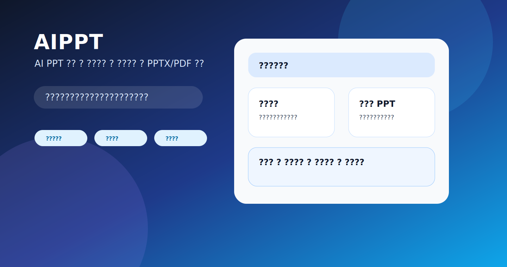
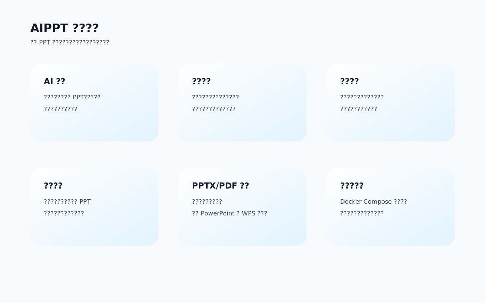
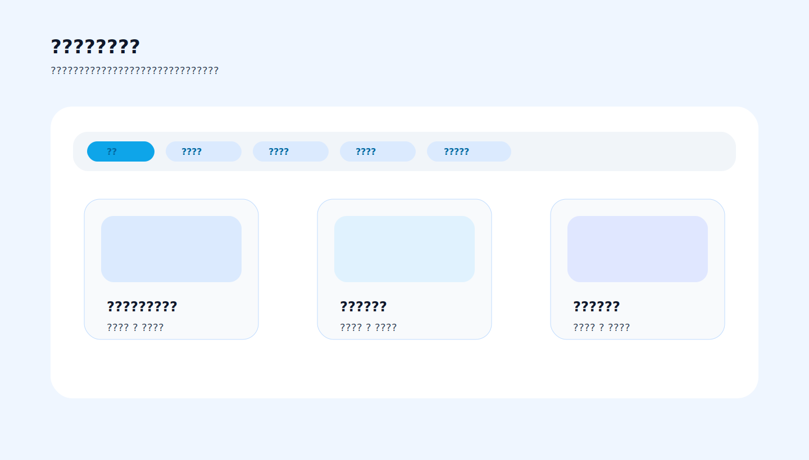
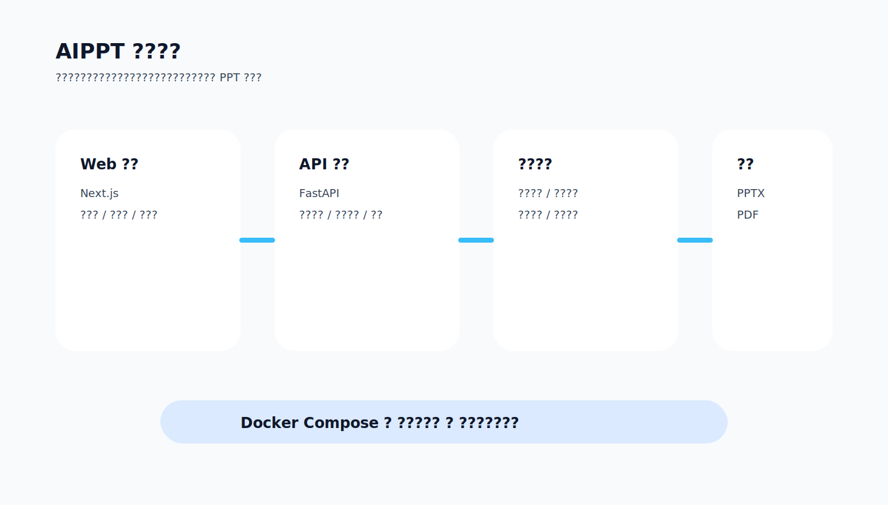

# AIPPT

> AIPPT 是一款开源 AI PPT 生成、编辑与导出平台，面向中文办公、汇报材料、项目报告、培训课件和行业模板场景，支持从主题、文档、模板和多模型能力快速生成可编辑演示文稿。



## 项目定位

AIPPT 在 [presenton/presenton](https://github.com/presenton/presenton/) 开源项目基础上进行了面向中文办公、行业模板、用户权限、模型配置和产品界面的重构。

AIPPT 不是简单的幻灯片截图工具，而是一个完整的 AI 演示文稿工作台。它围绕“生成、编辑、管理、导出、复用”五个环节构建，目标是让用户可以在浏览器中完成从选题到导出 PPTX/PDF 的完整流程。

适合的使用场景包括：

- 企业汇报：经营分析、项目进展、生产经营、周报月报、专题汇报。
- 行业模板：电厂专区、项目汇报、数据报告、产品介绍、培训课件。
- 文档转 PPT：从上传文档、资料摘要或文字大纲生成结构化演示文稿。
- 团队使用：管理员统一配置模型与服务，普通用户独立管理自己的作品。
- 私有化部署：通过 Docker 在本地、内网或服务器环境中运行。

## 功能总览



### AI 生成 PPT

- 支持根据一个主题自动生成完整 PPT。
- 支持根据用户输入的大纲生成页面结构。
- 支持上传文档后提取内容并生成演示文稿。
- 支持生成过程中实时查看进度。
- 支持对已生成 PPT 继续编辑和二次生成。

### 模板库与行业专区

- 内置通用模板、报告模板、产品模板等常见版式。
- 支持模板分类展示，便于按场景选择。
- 已加入“电厂专区”，可承载电力、煤电、工程建设、投产汇报等行业模板。
- 支持自定义模板保存与复用。
- 支持模板预览后再创建 PPT。



### 在线编辑

- 支持在浏览器中查看和编辑生成后的幻灯片。
- 支持文字、标题、列表、图片、图标、图表、布局等组件展示。
- 支持页面缩略图浏览与切换。
- 支持辅助编辑区域，方便继续优化内容。
- 支持中文界面和中文办公场景。

### PPTX/PDF 导出

- 支持导出可编辑 PPTX。
- 支持导出 PDF。
- 支持保留页面结构、文本内容、图片与模板布局。
- 适合导出后继续在 PowerPoint、WPS、Keynote 等工具中加工。

### 用户与权限

- 支持普通用户注册、登录、修改个人信息和退出登录。
- 普通用户只能查看和管理自己生成的 PPT。
- 管理员可以查看全部用户生成的 PPT。
- 管理员可以管理普通用户账号。
- 管理员可以统一配置文本生成、图片生成、联网搜索等服务提供商。

### 多模型与服务提供商

AIPPT 支持接入多种文本、图片和搜索服务，方便在本地模型、云模型和企业内网模型之间切换。

常见能力包括：

- OpenAI 兼容接口
- Ollama
- LM Studio
- Gemini
- Azure OpenAI
- Amazon Bedrock
- Anthropic
- Together AI
- Fireworks
- 自定义图片生成接口
- 联网搜索提供商配置

## 产品界面



AIPPT 的界面围绕中文用户重新设计，核心页面包括：

- 首页：创建 PPT、上传文档、进入模板库。
- 仪表盘：管理用户生成的 PPT。
- 模板库：按分类浏览和预览模板。
- 主题页：选择或管理演示文稿主题。
- 设置页：配置模型、图片、搜索、用户和账号。
- 编辑页：查看、编辑、导出生成后的 PPT。

## 技术架构

AIPPT 采用前后端分离架构，包含 Web 前端、API 后端、导出服务、模板系统和桌面端支持。

```text
AIPPT
├─ servers/nextjs      # Web 前端、模板库、编辑器、用户界面
├─ servers/fastapi     # API 后端、模型调用、任务处理、数据模型
├─ electron            # 桌面端相关能力
├─ readme_assets       # README 图片与展示资源
├─ docker-compose.yml  # Docker 编排配置
└─ Dockerfile          # 镜像构建配置
```

核心技术栈：

- Next.js：前端页面、模板预览、编辑器界面。
- FastAPI：后端接口、生成任务、配置管理。
- Python：文档处理、导出任务、服务编排。
- Docker：私有化部署与生产运行。
- Electron：桌面端打包与本地运行能力。

## 快速开始

### 使用 Docker Compose

```bash
docker compose up -d
```

启动后访问：

```text
http://localhost:5001
```

### 使用 Docker 运行

Linux/macOS：

```bash
docker run -it --name aippt -p 5001:80 -v "./app_data:/app_data" ghcr.io/cherzing/aippt:latest
```

Windows PowerShell：

```powershell
docker run -it --name aippt -p 5001:80 -v "${PWD}\app_data:/app_data" ghcr.io/cherzing/aippt:latest
```

## 本地开发

### 前端开发

```bash
cd servers/nextjs
npm install
npm run dev
```

### 后端开发

```bash
cd servers/fastapi
uv sync
uv run python -m api.main
```

### 桌面端开发

```bash
cd electron
npm run setup:env
npm run dev
```

## 配置说明

管理员可以在设置页中配置生成能力，也可以通过环境变量和配置文件进行部署级配置。

建议优先配置：

- 文本生成提供商：用于生成大纲、页面内容和演讲稿。
- 图片生成提供商：用于生成或检索幻灯片配图。
- 联网搜索提供商：用于补充实时资料和外部信息。
- 导出能力：用于生成 PPTX 和 PDF 文件。
- 用户权限：用于区分管理员与普通用户的数据范围。

## 模板系统

AIPPT 的模板系统面向真实办公场景设计，模板不仅是视觉皮肤，也包含页面结构、组件位置、文字层级和内容类型。

模板可以包含：

- 封面页
- 目录页
- 章节页
- 图文页
- 数据页
- 流程页
- 时间轴页
- 对比页
- 总结页
- 致谢页

模板分类可以用于组织不同业务场景。例如：

- 通用模板
- 报告模板
- 电厂专区
- 自定义模板

## 数据与权限边界

AIPPT 适合团队和个人共同使用：

- 普通用户：只能看到自己的 PPT、模板使用记录和账号信息。
- 管理员：可以查看全部 PPT、管理普通用户、配置全局服务。
- 配置隔离：普通用户看不到模型服务商、图片服务商和搜索服务商等管理配置。

## 部署建议

生产环境建议：

- 使用 Docker Compose 管理服务。
- 将 `app_data` 挂载到宿主机，避免数据随容器删除。
- 为模型接口配置稳定的内网或云端访问地址。
- 使用 HTTPS 反向代理暴露外部访问。
- 定期备份用户数据、生成记录和配置文件。

## 路线方向

后续重点方向：

- 提升 PPTX 原生导出的版式一致性。
- 完善更多中文行业模板。
- 增强模板分类、检索和预览体验。
- 增强管理员后台能力。
- 支持更精细的企业级权限与审计。
- 提升复杂图表、表格和图片排版能力。

## 许可证

本项目遵循仓库中 `LICENSE` 文件声明的许可证。

## 致谢

感谢 [presenton/presenton](https://github.com/presenton/presenton/) 项目提供的开源基础与启发。
