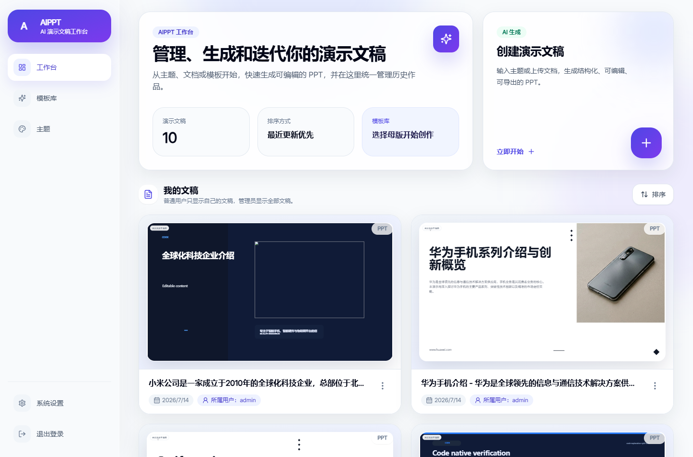
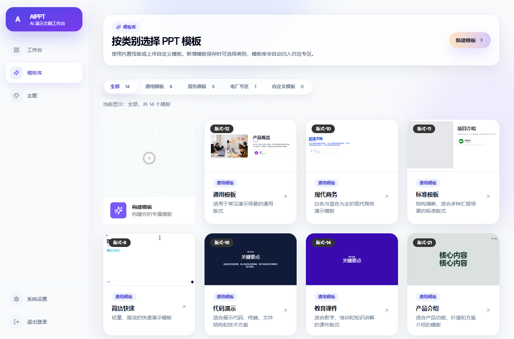
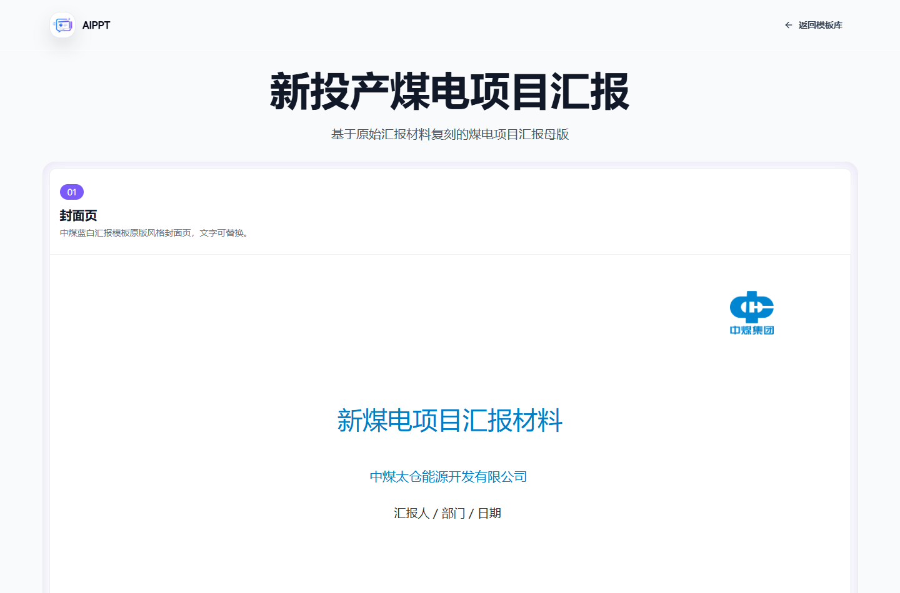
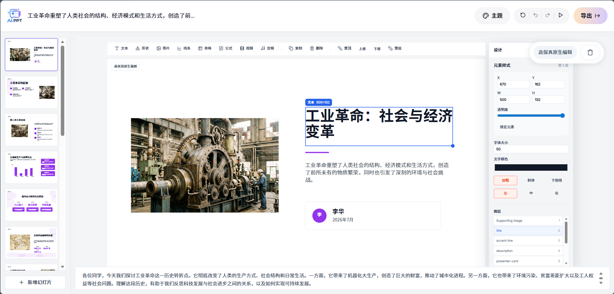
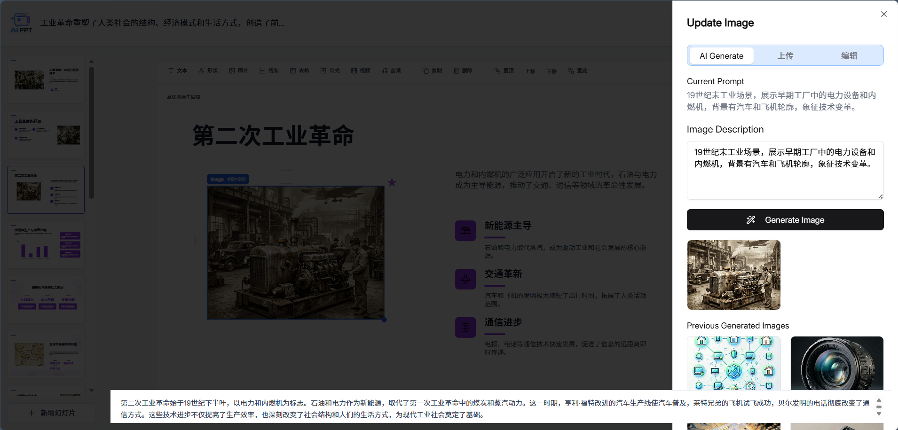

# AIPPT

<p align="center">
  
</p>

<p align="center">
  AIPPT is a self-hostable AI presentation generator and editor.
</p>

<p align="center">
  <a href="README.md">Chinese version</a>
</p>

## Project Overview

AIPPT is built for real office workflows. It supports the full path from topic, document, or outline to an editable presentation deck. It is not just a static preview generator. It is a slide production workspace centered on generation, editing, reuse, export, and deployment.

Users can choose a template, generate a deck, continue editing text, images, shapes, tables, and charts in the browser, and then export to PPTX or PDF. The project fits enterprise reports, project materials, industry templates, training decks, product introductions, technical proposals, and private office automation scenarios.

The project continues the open-source foundation of [presenton/presenton](https://github.com/presenton/presenton/) and expands it with Chinese office workflows, template categories, user permissions, model configuration, Docker deployment, AI image editing, and native editable models for selected templates.

## Core Capabilities

### AI Presentation Generation

- Generate PPT decks from a topic, prompt, document, or outline.
- Edit the outline before generation so the content structure is confirmed first.
- Use template-driven generation to preserve style and layout constraints.
- Show generation progress and manage presentation history.
- Continue editing and iterating on generated decks.

### Native Editable Slide Model

AIPPT addresses the common issue of AI-generated decks being hard to edit after export by introducing a native editable slide element model. Selected templates are no longer rendered only as a flattened background. They are broken into structured elements that can be selected, dragged, resized, and edited.

Supported element types include:

- text boxes and text styles;
- images and image prompts;
- shapes, lines, and decorative elements;
- tables;
- charts;
- formulas;
- media placeholders for video and audio.

This makes the generated deck much closer to a real office document. Users can edit it in the browser and continue working in PowerPoint, WPS, or Keynote after export.

### Template Library and Industry Templates

- Built-in general, business, standard, quick, code demo, education, product, report, pitch deck, and industry templates.
- Category-based browsing with general, report, power-plant, and custom template groups.
- Template preview before generation.
- Custom template creation, saving, and categorization.
- Industry templates for power plants and related reporting scenarios.
- Some built-in templates have been converted to native editable models to improve editing and export fidelity.

### AI Image Editing and Replacement

- Click an image to open the image editing panel.
- Generate replacement images from prompts.
- Upload a local image as a replacement.
- Reuse previous generated images.
- Configure providers such as Pexels and Pixabay.
- Support OpenAI-compatible image APIs, Open WebUI, ComfyUI, and related providers.

### PPTX / PDF Export

- Export to PPTX.
- Export to PDF.
- Bundled export runtime inside the Docker image.
- Native editable templates prefer native PPTX export paths.
- Legacy complex templates keep compatibility paths to reduce migration risk.

### Multi-Model and Self-Hosting Flexibility

Text models support multiple providers and compatibility modes:

- OpenAI-compatible API
- DeepSeek
- Google Gemini
- Azure OpenAI
- Amazon Bedrock
- Anthropic
- Together AI
- Fireworks
- Cerebras
- OpenRouter
- Ollama
- LM Studio
- Custom LLM endpoint

Image generation, web search, and memory capabilities can also be configured as needed. The system is designed for Docker-based deployment on local machines, internal networks, or servers.

### Users, Permissions, and Data

- Login-based authentication.
- Normal users manage their own decks.
- Administrators manage users and global model configuration.
- Runtime data, uploaded images, exports, and configuration are stored under `app_data`.
- External databases can be connected through `DATABASE_URL`; otherwise local storage is used.

## Screenshots

The screenshots below are captured from the current Docker-running AIPPT instance. They are real application screens, not generated mockups.

### Workspace



### Template Library



### Industry Template Preview



### Editable Editor



### AI Image Replacement



## Architecture

```text
AIPPT
├── servers/nextjs         # Web frontend, template library, editor, export routes
├── servers/fastapi        # API backend, generation services, model adapters, configuration
├── electron               # Desktop packaging and local integration
├── scripts                # Runtime sync, config bootstrap, helper scripts
├── readme_assets          # README screenshots and visual assets
├── app_data               # Runtime data mounted in Docker
├── Dockerfile             # Production image build configuration
└── docker-compose.yml     # Production, GPU, and development services
```

### Frontend

The frontend is built with Next.js, React, TypeScript, Tailwind CSS, Radix UI, and Redux. It owns the workspace, template library, settings pages, template preview, presentation editor, image editor panel, and export entry points.

### Backend

The backend is built with FastAPI and Python. It handles generation jobs, model calls, document processing, template discovery, user configuration, authentication, memory services, and business data APIs.

### Export Pipeline

The project ships with a bundled presentation export runtime. Generated decks are exported to office-friendly files through PPTX/PDF paths. The production Docker image includes browser, font, Office, image-processing, and export dependencies.

### Context Memory

The backend includes a Mem0-based presentation memory service for storing generation context, outline drafts, slide edit records, and retrieval context for later AI editing and Q&A operations.

## Quick Start

### Docker Compose

```bash
docker compose up -d --build production
```

Open:

```text
http://localhost:5001
```

Default ports:

- Web app: `http://localhost:5001`
- OAuth callback helper: `1455`
- Runtime data directory: `./app_data`

### GPU Service

```bash
docker compose up -d --build production-gpu
```

Use this service when your local model or image workflow requires GPU resources.

### Stop Services

```bash
docker compose down
```

## Configuration

Most production settings can be provided through environment variables or managed from the web settings page after login.

### OpenAI Example

```bash
LLM=openai
OPENAI_API_KEY=sk-...
OPENAI_MODEL=gpt-4.1
```

### DeepSeek Example

```bash
LLM=deepseek
DEEPSEEK_API_KEY=...
DEEPSEEK_MODEL=deepseek-chat
DEEPSEEK_BASE_URL=https://api.deepseek.com/v1
```

### Ollama Example

```bash
LLM=ollama
OLLAMA_URL=http://host.docker.internal:11434
OLLAMA_MODEL=llama3.1:latest
```

### Custom OpenAI-Compatible Endpoint

```bash
LLM=custom
CUSTOM_LLM_URL=http://localhost:11434/v1
CUSTOM_LLM_API_KEY=local-key
CUSTOM_MODEL=your-model-name
```

### Image Generation

```bash
IMAGE_PROVIDER=openai_compatible
OPENAI_COMPAT_IMAGE_BASE_URL=https://your-image-endpoint/v1
OPENAI_COMPAT_IMAGE_API_KEY=...
OPENAI_COMPAT_IMAGE_MODEL=...
```

### Authentication

```bash
AUTH_USERNAME=admin
AUTH_PASSWORD=change-me
```

Generated user configuration and login data are stored in:

```text
app_data/userConfig.json
```

## Development

### Frontend

```bash
cd servers/nextjs
npm install
npm run dev
```

### Backend

```bash
cd servers/fastapi
uv sync
uv run python -m api.main
```

### Docker Development Service

```bash
docker compose up -d --build development
```

## Testing and Verification

Frontend tests:

```bash
cd servers/nextjs
node --test tests/*.test.mjs
```

Next.js production build:

```bash
cd servers/nextjs
npm run build
```

Backend tests:

```bash
cd servers/fastapi
uv run pytest
```

Export runtime check:

```bash
npm run check:presentation-export
```

## Template System

Template directory:

```text
servers/nextjs/app/presentation-templates
```

Current template groups include:

- `general`
- `modern`
- `standard`
- `swift`
- `Code`
- `Education`
- `ProductOverview`
- `Report`
- `pitch-deck`
- `neo-general`
- `neo-modern`
- `neo-standard`
- `neo-swift`
- `taicang-coal-power-report`

Native PPT model helpers live under:

```text
servers/nextjs/lib/pptx-model
```

These modules classify template capabilities, validate native slide documents, convert built-in templates, and route export behavior.

## Production Notes

- Mount `app_data` so user data, generation history, and configuration are not lost with the container.
- Configure stable model, image, and search providers before team use.
- Use HTTPS reverse proxying for public access.
- Back up `app_data` regularly.
- Check screenshots and logs for API keys, user data, or internal materials before sharing.
- Keep Docker dependencies aligned with the export runtime version.

## Roadmap

- Improve native PPTX fidelity for more complex templates.
- Expand more Chinese industry template zones.
- Strengthen enterprise permissions, audit, and collaboration features.
- Improve chart, table, formula, and media editing.
- Improve conversion of imported PPT templates into native editable elements.
- Add stronger end-to-end coverage for generation, editing, and export flows.

## License

This project follows the license declared in [LICENSE](LICENSE).

## Acknowledgements

AIPPT continues the open-source work of [presenton/presenton](https://github.com/presenton/presenton/). Thanks to the open-source projects, model services, and toolchains that make self-hosted AI office workflows possible.
